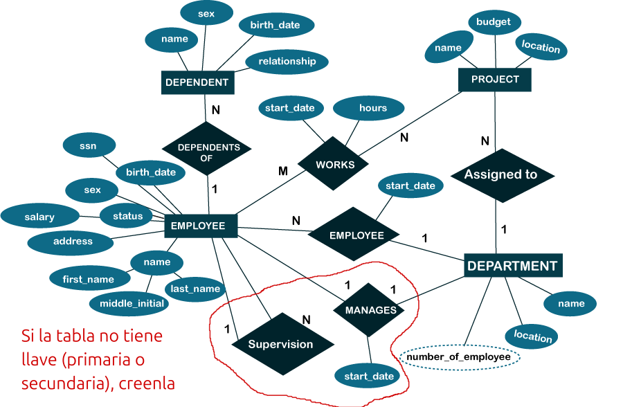

# Ejemplificación de Operaciones de Álgebra Relacional en MySQL

---

- [Ejemplificación de Operaciones de Álgebra Relacional en MySQL](#ejemplificación-de-operaciones-de-álgebra-relacional-en-mysql)
  - [Paso 1: Creación de la base de datos y las tablas](#paso-1-creación-de-la-base-de-datos-y-las-tablas)
  - [Paso 2: Poblar las tablas con datos de ejemplo](#paso-2-poblar-las-tablas-con-datos-de-ejemplo)
  - [Paso 3: Consultas ejemplificando las operaciones del álgebra relacional](#paso-3-consultas-ejemplificando-las-operaciones-del-álgebra-relacional)
    - [Operaciones de Conjuntos](#operaciones-de-conjuntos)
      - [a) Unión ( ∪ )](#a-unión---)
      - [b) Intersección ( ∩ )](#b-intersección---)
      - [c) Diferencia ( − )](#c-diferencia---)
    - [Operaciones Relacionales](#operaciones-relacionales)
      - [a) Selección (σ)](#a-selección-σ)
      - [b) Proyección (π)](#b-proyección-π)
      - [c) Reunión (⨝)](#c-reunión-)
      - [d) División ( ÷ )](#d-división---)
  - [Conclusión](#conclusión)
  - [Taller](#taller)
    - [Creación de BD](#creación-de-bd)
    - [Consultas](#consultas)


---

En este taller, vamos a implementar y ejemplificar las principales operaciones del álgebra relacional usando MySQL. Se utilizarán varias operaciones como selección, proyección, unión, intersección, diferencia y reunión. El escenario que trabajaremos será una base de datos que simula una **librería** con tres tablas principales: **Libros**, **Clientes**, y **Ventas**.

## Paso 1: Creación de la base de datos y las tablas
Primero, crearemos las tablas que vamos a usar:

```sql
CREATE DATABASE Libreria;
USE Libreria;

-- Tabla de libros
CREATE TABLE Libros (
    idLibro INT PRIMARY KEY,
    titulo VARCHAR(100),
    autor VARCHAR(100),
    precio DECIMAL(10, 2)
);

-- Tabla de clientes
CREATE TABLE Clientes (
    idCliente INT PRIMARY KEY,
    nombre VARCHAR(100),
    email VARCHAR(100)
);

-- Tabla de ventas
CREATE TABLE Ventas (
    idVenta INT PRIMARY KEY,
    idLibro INT,
    idCliente INT,
    fecha DATE,
    cantidad INT,
    FOREIGN KEY (idLibro) REFERENCES Libros(idLibro),
    FOREIGN KEY (idCliente) REFERENCES Clientes(idCliente)
);
```

## Paso 2: Poblar las tablas con datos de ejemplo

```sql
-- Insertar libros
INSERT INTO Libros (idLibro, titulo, autor, precio) VALUES
(1, 'Cien años de soledad', 'Gabriel García Márquez', 45.50),
(2, 'La vorágine', 'José Eustasio Rivera', 55.00),
(3, 'El amor en los tiempos del cólera', 'Gabriel García Márquez', 60.00),
(4, 'Delirio', 'Laura Restrepo', 30.00),
(5, 'El olvido que seremos', 'Héctor Abad Faciolince', 70.00);

-- Insertar clientes
INSERT INTO Clientes (idCliente, nombre, email) VALUES
(1, 'Carlos Ramírez', 'carlos@example.com'),
(2, 'Laura Pérez', 'laura@example.com'),
(3, 'Ana Gómez', 'ana@example.com');

-- Insertar ventas
INSERT INTO Ventas (idVenta, idLibro, idCliente, fecha, cantidad) VALUES
(1, 1, 1, '2024-01-15', 1),
(2, 2, 2, '2024-01-16', 2),
(3, 1, 3, '2024-02-01', 1),
(4, 3, 1, '2024-03-15', 1),
(5, 5, 2, '2024-04-10', 1);
```

## Paso 3: Consultas ejemplificando las operaciones del álgebra relacional

### Operaciones de Conjuntos 

#### a) Unión ( ∪ )

Obtener todos los clientes y sus correos, incluyendo los que están en otras tablas de clientes adicionales. Simularemos la unión utilizando la operación `UNION` de SQL.

```sql
-- Tabla adicional Clientes_Extra para simular la unión
CREATE TABLE Clientes_Extra (
    idCliente INT PRIMARY KEY,
    nombre VARCHAR(100),
    email VARCHAR(100)
);

-- Insertar datos en Clientes_Extra
INSERT INTO Clientes_Extra (idCliente, nombre, email) VALUES
(4, 'Jorge Ruiz', 'jorge@example.com'),
(5, 'Marta Castro', 'marta@example.com');

-- Unión de Clientes y Clientes_Extra
SELECT nombre, email FROM Clientes
UNION
SELECT nombre, email FROM Clientes_Extra;
```

**Resultado:**

| nombre        | email              |
|---------------|--------------------|
| Carlos Ramírez| carlos@example.com |
| Laura Pérez   | laura@example.com  |
| Ana Gómez     | ana@example.com    |
| Jorge Ruiz    | jorge@example.com  |
| Marta Castro  | marta@example.com  |

#### b) Intersección ( ∩ )

Encontrar clientes que existen en ambas tablas. En MySQL, podemos simular la intersección utilizando `INNER JOIN` entre dos tablas.

```sql
SELECT nombre, email FROM Clientes
INNER JOIN Clientes_Extra ON Clientes.email = Clientes_Extra.email;
```

Esa consulta genera un error, ¿cómo se puede solucionar, por qué ocurre?.

**Resultado:**

(Si hubiera clientes con correos repetidos en ambas tablas, aparecerían aquí, pero con los datos actuales no hay resultados).

#### c) Diferencia ( − )

Encontrar libros que no han sido vendidos.

```sql
SELECT * FROM Libros
WHERE idLibro NOT IN (SELECT idLibro FROM Ventas);
```

**Resultado:**

| idLibro | titulo   | autor              | precio |
|---------|----------|--------------------|--------|
| 4       | Delirio  | Laura Restrepo     | 30.00  |

### Operaciones Relacionales

#### a) Selección (σ)

Obtener todos los libros cuyo precio sea mayor a 50.

```sql
SELECT * FROM Libros WHERE precio > 50;
```

**Resultado:**

| idLibro | titulo                           | autor                     | precio |
|---------|----------------------------------|----------------------------|--------|
| 2       | La vorágine                      | José Eustasio Rivera       | 55.00  |
| 3       | El amor en los tiempos del cólera| Gabriel García Márquez     | 60.00  |
| 5       | El olvido que seremos            | Héctor Abad Faciolince     | 70.00  |

#### b) Proyección (π)

Seleccionar solo los nombres de los libros.

```sql
SELECT titulo FROM Libros;
```

**Resultado:**

| titulo                           |
|----------------------------------|
| Cien años de soledad             |
| La vorágine                      |
| El amor en los tiempos del cólera|
| Delirio                          |
| El olvido que seremos            |


#### c) Reunión (⨝)

Reunir la información de las ventas y los clientes.

```sql
SELECT Ventas.idVenta, Clientes.nombre, Libros.titulo, Ventas.fecha, Ventas.cantidad
FROM Ventas
JOIN Clientes ON Ventas.idCliente = Clientes.idCliente
JOIN Libros ON Ventas.idLibro = Libros.idLibro;
```

**Resultado:**

| idVenta | nombre        | titulo                           | fecha       | cantidad |
|---------|---------------|----------------------------------|-------------|----------|
| 1       | Carlos Ramírez| Cien años de soledad             | 2024-01-15  | 1        |
| 2       | Laura Pérez   | La vorágine                      | 2024-01-16  | 2        |
| 3       | Ana Gómez     | Cien años de soledad             | 2024-02-01  | 1        |
| 4       | Carlos Ramírez| El amor en los tiempos del cólera| 2024-03-15  | 1        |
| 5       | Laura Pérez   | El olvido que seremos            | 2024-04-10  | 1        |

#### d) División ( ÷ )

Simularemos un ejemplo simple de división. Encontrar los clientes que han comprado todos los libros disponibles.

```sql
SELECT Clientes.nombre FROM Clientes
WHERE NOT EXISTS (
    SELECT idLibro FROM Libros
    WHERE idLibro NOT IN (
        SELECT idLibro FROM Ventas WHERE Ventas.idCliente = Clientes.idCliente
    )
);
```

**Resultado:**

(Si algún cliente hubiera comprado todos los libros disponibles, aparecería aquí. En este caso, no hay resultados ya que ningún cliente ha comprado todos los libros).

## Conclusión
En este taller hemos ejemplificado cómo el álgebra relacional se puede aplicar en MySQL utilizando las diferentes operaciones que permiten manipular los datos en una base de datos. Esto incluye operaciones de conjuntos como la unión, intersección y diferencia, así como operaciones relacionales como la selección, proyección y reunión.

## Taller

### Creación de BD

Basado en la siguiente imagen, generen el código que crea la base de datos y las tablas.

<div align="center">

</div>

Ya creado el código que crea el esquema, ahora poblemos las tablas. Las relaciones tendrán sentido con los datos que se llenen, los datos son los que definen que tipo de relación existe. Si es necesario agreguen 7 datos o más por tabla de tal forma que sea coherente las relaciones entre tablas.

>[!NOTE]
>No tienen que hacer la parte que esta dentro de la forma en rojo (relación supervision ni manages). Y **deben** tener llaves primarias en todas las tablas, de ser necesario también pueden agregar llaves foráneas.

### Consultas

Basado en el diagrama de entidad-relación de la anterior imagen, que representa una base de datos de una empresa, aquí tienes 15 preguntas que se pueden resolver utilizando consultas en MySQL. Estas preguntas están diseñadas para cubrir diferentes aspectos de la base de datos y requieren el uso de consultas SQL comunes, como `SELECT`, `JOIN`, `GROUP BY`, `HAVING`, entre otras.

1. **¿Cuál es el nombre y dirección de los empleados que trabajan en el departamento de 'Research'?**

   - **Concepto**: `JOIN` entre las tablas de empleados y departamentos.
   
   ```sql
   ```

2. **¿Qué proyectos están localizados en la misma ciudad donde viven los empleados que trabajan en ellos?**

   - **Concepto**: `JOIN` entre las tablas de empleados, proyectos y departamento.
   
   ```sql
   ```

3. **¿Cuál es el número total de horas trabajadas por cada empleado en diferentes proyectos?**

   - **Concepto**: `GROUP BY` con `SUM` para sumar las horas trabajadas.
   
   ```sql
   ```

4. **¿Cuáles son los empleados que no tienen dependientes?**

   - **Concepto**: `LEFT JOIN` y `WHERE` para buscar empleados sin dependientes.
   
   ```sql
   ```

5. **¿Cuál es el salario promedio de los empleados en cada departamento?**

   - **Concepto**: `GROUP BY` y `AVG` para calcular el promedio.
   
   ```sql
   ```

6. **¿Qué empleados trabajan en el proyecto 'ProductX' y cuántas horas le han dedicado?**

   - **Concepto**: `JOIN` con filtro para el nombre del proyecto.
   
   ```sql
   ```

7. **¿Cuáles son los nombres de los empleados que supervisan a otros empleados?**

   - **Concepto**: `SELF JOIN` para encontrar los empleados supervisores.
   
   ```sql
   ```

8. **¿Cuál es el nombre del gerente de cada departamento?**

   - **Concepto**: `JOIN` entre empleados y departamentos, filtrando por el gerente.
   
   ```sql
   ```

9. **¿Qué departamentos no tienen proyectos asignados?**

   - **Concepto**: `LEFT JOIN` entre departamentos y proyectos.
   
   ```sql
   ```

10. **¿Qué dependientes tienen los empleados cuyo salario es mayor a 50,000?**

   - **Concepto**: `JOIN` entre empleados y dependientes con filtro de salario.
   
   ```sql
   ```

11. **¿Cuántos empleados trabajan en cada proyecto?**

   - **Concepto**: `GROUP BY` y `COUNT` para contar empleados por proyecto.
   
   ```sql
   ```

12. **¿Qué proyectos tienen empleados que trabajaron más de 10 horas en ellos?**

   - **Concepto**: `JOIN` con filtro de horas trabajadas.
   
   ```sql
   ```

13. **¿Cuál es el nombre del proyecto y la ubicación del mismo donde trabaja el mayor número de empleados?**

   - **Concepto**: `JOIN`, `GROUP BY` y `ORDER BY` con `LIMIT`.
   
   ```sql
   ```

14. **¿Cuál es el salario más alto, el más bajo y el promedio en toda la empresa?**

   - **Concepto**: Uso de funciones de agregación `MAX`, `MIN`, `AVG`.
   
   ```sql
   
   ```

15. **¿Cuál es la edad de los empleados que tienen dependientes y están trabajando en más de un proyecto?**

   - **Concepto**: `JOIN` y `GROUP BY` con filtro.
   
   ```sql

   ```

Estas preguntas y consultas permiten explorar la base de datos de manera completa, cubriendo operaciones importantes de `JOIN`, `GROUP BY`, `HAVING`, y agregando funciones en MySQL.