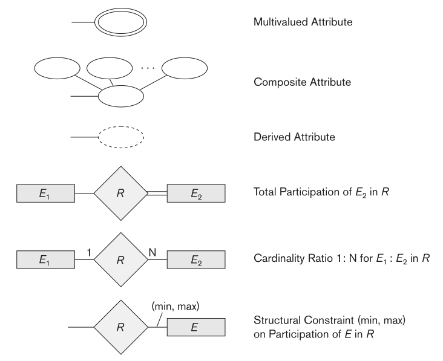
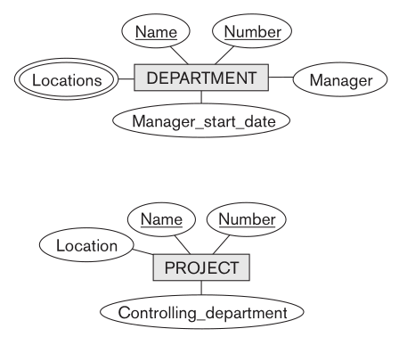
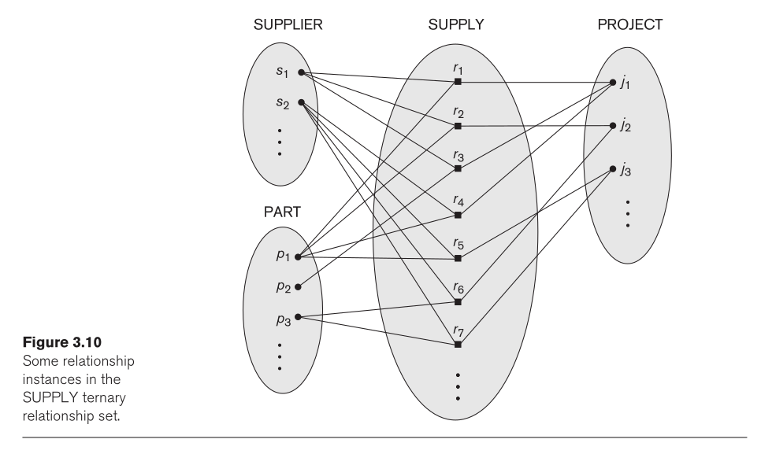
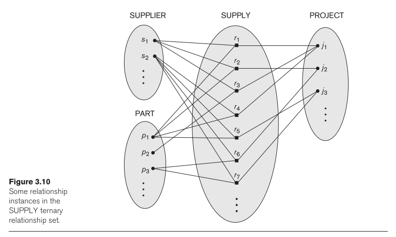
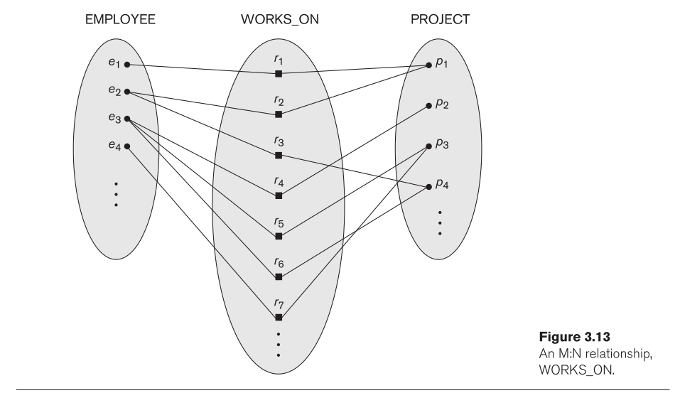
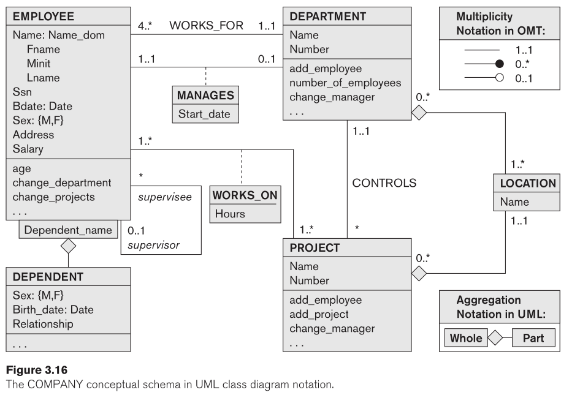
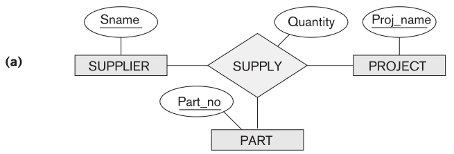

# Modelo Entidad-Relación (ERD)

---

- [Modelo Entidad-Relación (ERD)](#modelo-entidad-relación-erd)
  - [Introducción](#introducción)
  - [Objetivos](#objetivos)
  - [Conceptualización](#conceptualización)
  - [Campos de Aplicación](#campos-de-aplicación)
  - [Elementos del Modelo E/R](#elementos-del-modelo-er)
  - [Requisitos para que se dé una relación](#requisitos-para-que-se-dé-una-relación)
  - [Ejemplo de Diagrama E/R](#ejemplo-de-diagrama-er)
  - [Implementación del Modelo E/R en MySQL](#implementación-del-modelo-er-en-mysql)
    - [Mejoras](#mejoras)
  - [Aplicación de las Formas Normales](#aplicación-de-las-formas-normales)
  - [Taller o Ejercicio Práctico](#taller-o-ejercicio-práctico)
  - [Conclusiones](#conclusiones)
  - [Referencias](#referencias)
    - [Libros](#libros)
    - [Guías y Tutoriales](#guías-y-tutoriales)


---

## Introducción

El **Modelo Entidad-Relación (E/R)** es una herramienta fundamental en el diseño de bases de datos. Permite representar gráficamente las entidades y las relaciones que existen entre ellas en un dominio de información. Su uso es ampliamente aplicado en la fase de diseño conceptual, facilitando la creación de una estructura lógica que, posteriormente, se convierte en una base de datos relacional implementada en sistemas como MySQL.

## Objetivos

- Comprender los conceptos básicos del Modelo Entidad-Relación (E/R).
- Identificar los campos de aplicación del modelo E/R en sistemas reales.
- Conocer los elementos que conforman un diagrama E/R, como entidades, relaciones, atributos y llaves.
- Analizar los requisitos necesarios para establecer relaciones, incluyendo cardinalidad, participación y claves.
- Aplicar los conceptos aprendidos en la construcción de un diagrama E/R y su implementación en MySQL.

## Conceptualización


<center>
<table>
<tr>
<td>

[](https://www.youtube.com/watch?v=TKuxYHb-Hvc)

</td>
<td>

[](https://www.youtube.com/watch?v=xsg9BDiwiJE)

</td>
</tr>
</table>
</center>

El **Modelo Entidad-Relación** fue propuesto por Peter Chen en 1976 y es una de las metodologías más populares para el diseño de bases de datos. En este modelo, se utilizan diagramas (Diagramas E/R) para representar gráficamente las **entidades**, sus **atributos** y las **relaciones** que existen entre ellas.

<div align="center">
  
  
</div>

- **Entidad:** Es cualquier objeto o concepto que puede ser identificado de manera única dentro de un dominio. En una base de datos, una entidad puede ser una persona, un lugar o cualquier cosa de interés, como "Estudiante", "Curso" o "Producto".
  
- **Atributos:** Son las características o propiedades que describen una entidad. Por ejemplo, una entidad "Estudiante" puede tener los atributos "Nombre", "Edad" y "Matrícula".
  
  <div align="center">
    
    
  </div>


- **Relación:** Es una asociación entre dos o más entidades. Por ejemplo, una relación entre "Estudiante" y "Curso" puede representar la inscripción de un estudiante en un curso.

<div align="center">
  
  
  
  
  
</div>


**Ejemplos de digramas**

1.
<div align="center">
  
</div>

2.

<div align="center">
  
</div>

3.

<div align="center">
  
</div>

4.

<div align="center">
  
  
</div>

**Figura 3.17**: Tipos de relaciones ternarias. (a) La relación SUMINISTRO. (b) Tres relaciones binarias no equivalentes a SUPPLY. (c) SUPPLY representada como un tipo de entidad débil.


## Campos de Aplicación

El modelo E/R es aplicable en cualquier ámbito donde se necesite estructurar información para su posterior almacenamiento y consulta. Algunos ejemplos de campos donde se puede aplicar el modelo E/R incluyen:

- **Sistemas de Gestión de Inventarios**
- **Sistemas de Información para Universidades** (gestión de estudiantes, profesores, materias, etc.)
- **Plataformas de Comercio Electrónico**
- **Sistemas de Recursos Humanos**
- **Plataformas de Redes Sociales**

## Elementos del Modelo E/R

El modelo E/R se compone de varios elementos clave que permiten su correcta construcción:

- **Entidades:** Representan los objetos o conceptos que se quieren almacenar en la base de datos. Ejemplos: `Estudiante`, `Curso`, `Producto`.

- **Atributos:** Son las características de las entidades. Ejemplo: la entidad `Estudiante` puede tener atributos como `nombre`, `edad`, `matrícula`.

- **Relaciones:** Muestran cómo las entidades están relacionadas entre sí. Ejemplo: Un `Estudiante` se inscribe en un `Curso`.

- **Cardinalidad:** Especifica el número de instancias de una entidad que pueden estar asociadas a una instancia de otra entidad en una relación. Ejemplo: Un `Estudiante` puede estar inscrito en muchos `Cursos`, pero un `Curso` puede tener muchos `Estudiantes` inscritos (relación muchos a muchos).

- **Llaves Primarias (Primary Keys):** Atributo o conjunto de atributos que identifican de manera única una instancia de entidad. Ejemplo: el atributo `matrícula` es la llave primaria de `Estudiante`.

- **Llaves Foráneas (Foreign Keys):** Atributo en una entidad que hace referencia a la llave primaria de otra entidad, estableciendo una relación entre ellas.

## Requisitos para que se dé una relación

Para establecer una relación entre dos entidades en un modelo E/R, se deben cumplir ciertos requisitos:

1. **Cardinalidad:** Define cuántas instancias de una entidad están asociadas con las instancias de otra entidad. Los tipos de cardinalidad más comunes son:
   - **Uno a uno (1:1):** Una instancia de una entidad está relacionada con una única instancia de otra entidad.
   - **Uno a muchos (1:N):** Una instancia de una entidad puede estar relacionada con múltiples instancias de otra entidad.
   - **Muchos a muchos (N:M):** Varias instancias de una entidad están relacionadas con varias instancias de otra entidad.

2. **Participación:** Indica si la participación de una entidad en una relación es total o parcial. Si es **total**, todas las instancias de la entidad participan en la relación; si es **parcial**, algunas instancias pueden no participar.

3. **Llaves:** Las llaves son cruciales para garantizar la unicidad de las entidades y las relaciones. Las **llaves primarias** permiten identificar de manera única una entidad, mientras que las **llaves foráneas** permiten vincular entidades a través de relaciones.

## Ejemplo de Diagrama E/R

Consideremos un ejemplo de un sistema de gestión de estudiantes y cursos. En este caso, tenemos dos entidades principales: `Estudiante` y `Curso`, y una relación entre ellas llamada `Inscripción`.

- La entidad `Estudiante` tiene los atributos `nombre`, `edad` y `matrícula`.
- La entidad `Curso` tiene los atributos `nombreCurso` y `idCurso`.
- La relación `Inscripción` indica que un estudiante se inscribe en un curso.

## Implementación del Modelo E/R en MySQL

En este ejemplo, vamos a implementar las entidades `Estudiante`, `Curso` y la relación `Inscripción` en MySQL.

```sql
-- Creación de la base de datos Universidad
CREATE DATABASE IF NOT EXISTS Universidad;

-- Selección de la base de datos para su uso
USE Universidad;

-- Tabla Estudiante: Almacena la información de los estudiantes
CREATE TABLE IF NOT EXISTS Estudiante (
    matricula INT AUTO_INCREMENT,        -- Matricula como clave primaria y valor auto-incremental
    nombre VARCHAR(50) NOT NULL,          -- Nombre del estudiante, campo obligatorio
    edad INT CHECK (edad >= 17),          -- Edad del estudiante con restricción (debe ser mayor o igual a 17)
    fechaNacimiento DATE,                 -- Fecha de nacimiento opcional
    -- STR_TO_DATE('12-05-2004', '%d-%m-%Y')
    -- DATE_FORMAT(fechaNacimiento, '%d-%m-%Y')
    direccion VARCHAR(100),               -- Dirección del estudiante
    telefono VARCHAR(15),                 -- Teléfono opcional
    correoElectronico VARCHAR(100),       -- Correo electrónico único
    PRIMARY KEY (matricula),              -- Clave primaria (matricula)
    UNIQUE (correoElectronico),           -- El correo debe ser único
    INDEX(nombre)                         -- Índice para mejorar la búsqueda por nombre
) ENGINE=InnoDB DEFAULT CHARSET=utf8mb4;

-- Tabla Curso: Almacena la información de los cursos
CREATE TABLE IF NOT EXISTS Curso (
    idCurso INT AUTO_INCREMENT,           -- ID del curso como clave primaria y valor auto-incremental
    nombreCurso VARCHAR(100) NOT NULL,    -- Nombre del curso, campo obligatorio
    descripcion TEXT,                     -- Descripción opcional del curso
    duracion INT,                         -- Duración del curso en horas
    nivel ENUM('Basico', 'Intermedio', 'Avanzado'),  -- Nivel del curso
    PRIMARY KEY (idCurso),                -- Clave primaria (idCurso)
    INDEX(nombreCurso)                    -- Índice para mejorar la búsqueda por nombre de curso
) ENGINE=InnoDB DEFAULT CHARSET=utf8mb4;

-- Tabla Inscripcion: Almacena la relación entre estudiantes y cursos
CREATE TABLE IF NOT EXISTS Inscripcion (
    matricula INT,                        -- Clave foránea que hace referencia a la matrícula del estudiante
    idCurso INT,                          -- Clave foránea que hace referencia al ID del curso
    fechaInscripcion DATE NOT NULL,       -- Fecha en la que se inscribió el estudiante al curso
    estado ENUM('Inscrito', 'Completado', 'Retirado') DEFAULT 'Inscrito',  -- Estado de la inscripción
    calificacion DECIMAL(3,2) CHECK (calificacion BETWEEN 0.0 AND 10.0),  -- Calificación entre 0.00 y 10.00
    PRIMARY KEY (matricula, idCurso),     -- Clave primaria compuesta (matricula e idCurso)
    FOREIGN KEY (matricula) REFERENCES Estudiante(matricula)
        ON DELETE CASCADE                 -- Si un estudiante se borra, se eliminan sus inscripciones
        ON UPDATE CASCADE,                -- Si se actualiza la matrícula del estudiante, también se actualiza aquí
    FOREIGN KEY (idCurso) REFERENCES Curso(idCurso)
        ON DELETE RESTRICT                -- No permite eliminar un curso si tiene inscripciones activas
        ON UPDATE CASCADE,                -- Si se actualiza el idCurso, también se actualiza aquí
    UNIQUE (matricula, idCurso),          -- Asegura que no se repita la inscripción de un mismo estudiante en un mismo curso
    INDEX(fechaInscripcion)               -- Índice para búsquedas por fecha de inscripción
) ENGINE=InnoDB DEFAULT CHARSET=utf8mb4;

-- Comentarios:
-- 1. La tabla "Estudiante" incluye un índice en el nombre para mejorar las búsquedas por este campo.
-- 2. La tabla "Curso" tiene un índice similar en el nombre del curso.
-- 3. Se han agregado restricciones en la tabla "Inscripcion" para asegurar que los datos ingresados sean consistentes y válidos.
-- 4. Se han definido relaciones con claves foráneas para mantener la integridad referencial.
-- 5. Las opciones "ON DELETE CASCADE" y "ON DELETE RESTRICT" garantizan un manejo adecuado de la eliminación de registros relacionados.
```

### Mejoras

1. **AUTO_INCREMENT:** He agregado `AUTO_INCREMENT` a las claves primarias `matricula` y `idCurso`, lo cual permite generar valores únicos automáticamente para cada nuevo registro, lo que facilita la inserción de nuevos datos.
   
2. **Restricciones:** Se agregaron restricciones como `CHECK` en los campos `edad` y `calificacion` para asegurar que los valores sean válidos dentro de ciertos rangos.

3. **Unicidad y Claves:** La columna `correoElectronico` en la tabla `Estudiante` es única para evitar la duplicación de correos electrónicos. La combinación de `matricula` e `idCurso` en la tabla `Inscripcion` es única para evitar que un estudiante se inscriba más de una vez en el mismo curso.

4. **Integridad referencial:** Las claves foráneas en `Inscripcion` se utilizan para asegurar que las relaciones entre `Estudiante` y `Curso` se mantengan consistentes. Las opciones `ON DELETE CASCADE` y `ON DELETE RESTRICT` gestionan el comportamiento de las relaciones cuando se eliminan o actualizan registros.

5. **Índices:** Se añadieron índices para mejorar el rendimiento en las búsquedas y consultas frecuentes, como `nombre` en `Estudiante`, `nombreCurso` en `Curso` y `fechaInscripcion` en `Inscripcion`.

## Aplicación de las Formas Normales

Una vez que hemos diseñado nuestro diagrama E/R y creado las tablas correspondientes, debemos asegurarnos de que las tablas estén normalizadas. Para este caso, podemos aplicar la **Primera Forma Normal (1FN)**, que indica que todos los atributos deben contener valores atómicos, es decir, no repetibles.

## Taller o Ejercicio Práctico

Utilizando la tabla normalizada creada en las anteriores clases, diseñen un diagrama ER y EER.

## Conclusiones

El Modelo Entidad-Relación es una herramienta clave en el diseño conceptual de bases de datos, permitiendo la representación gráfica de las entidades, sus atributos y relaciones. Al normalizar las tablas derivadas del modelo E/R, garantizamos que la base de datos sea eficiente y libre de redundancias. La implementación de un diagrama E/R en MySQL se traduce en la creación de tablas y relaciones mediante el uso de llaves primarias y foráneas, aplicando los principios de cardinalidad y participación.

## Referencias

### Libros

- Elmasri, R., & Navathe, S. B. (2011). **Fundamentals of Database Systems**. Addison-Wesley.
- Coronel, C., & Morris, S. (2016). **Database Systems: Design, Implementation, & Management**. Cengage Learning.
- MySQL Documentation: https://dev.mysql.com/doc

### Guías y Tutoriales

- [ER diagrams vs. EER diagrams: What’s the difference?](https://nulab.com/learn/software-development/er-diagrams-vs-eer-diagrams-whats-the-difference/)
- [What is an Entity Relationship Diagram (ERD)?](https://www.lucidchart.com/pages/er-diagrams)
- [Entity–relationship model](https://en.wikipedia.org/wiki/Entity%E2%80%93relationship_model)