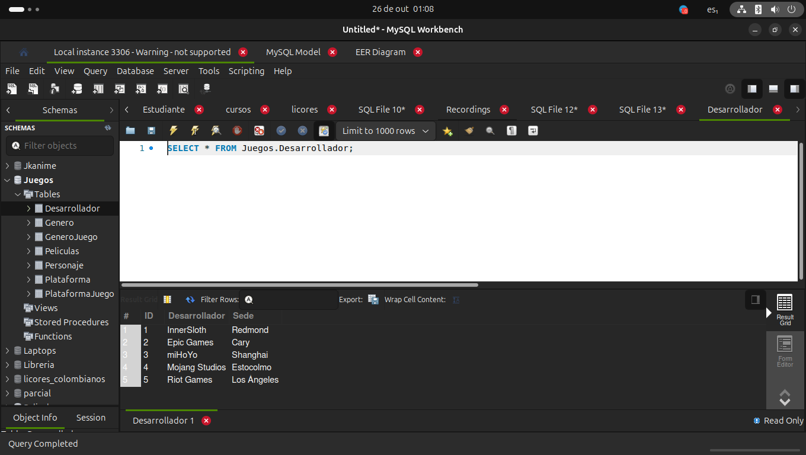
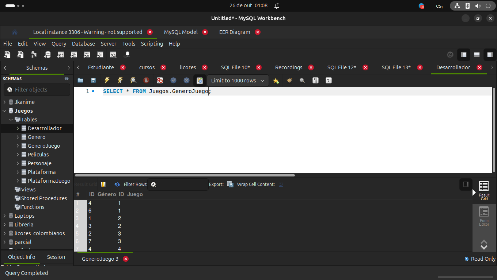
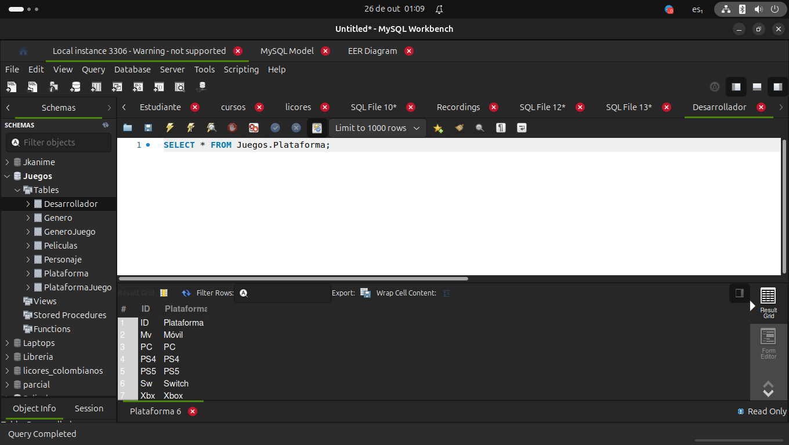

# Solución

## Creación e Importación de Datos

<div align="center">
  
  
  
  
  
  
  
</div>

## Consultas


**1. Proyección: Obtener los Títulos y Años de Lanzamiento**

$$
\pi_{\text{Título\_del\_Juego, Año\_de\_Lanzamiento}}(\text{Juegos})
$$

```sql
SELECT Titulo_del_Juego, Año_de_Lanzamiento FROM Juegos;
```

**2. Selección: Filtrar juegos del género "RPG"**

$$
\sigma_{\text{Género} = 'RPG'}(\text{Juegos})
$$

```sql
SELECT * FROM Juegos WHERE Genero="RPG;
```

**3. Proyección: Obtener solo los Desarrolladores y sus Sedes**

$$
\pi_{\text{Desarrollador, Sede\_del\_Desarrollador}}(\text{Juegos})
$$

```sql
SELECT Desarrollador,Sede_del_Desarrollador FROM Juegos;
```

**4. Selección: Filtrar juegos con calificación mayor a 8.0**

$$
\sigma_{\text{Calificación} > 8.0}(\text{Juegos})
$$

```sql
SELECT * FROM  Juegos WHERE Calificacion>8;
```

**5. Proyección y Selección: Obtener Títulos y Personajes Principales de juegos lanzados después de 2015**

$$
\pi_{\text{Título\_del\_Juego, Personajes\_Principales}}(\sigma_{\text{Año\_de\_Lanzamiento} > 2015}(\text{Juegos}))
$$

```sql
SELECT Titulo, Personaje FROM  Juegos WHERE Año_Lanzamiento>2015;
```