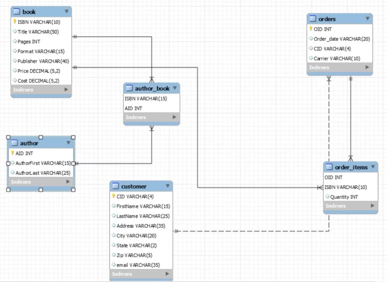

# Segundo Examen Práctico: Normalización y Modelado de Base de Datos

---

- [Segundo Examen Práctico: Normalización y Modelado de Base de Datos](#segundo-examen-práctico-normalización-y-modelado-de-base-de-datos)
  - [Instrucciones](#instrucciones)
  - [Contexto](#contexto)
  - [Tareas](#tareas)
    - [Parte 1: Normalización hasta la Tercera Forma Normal (3FN)](#parte-1-normalización-hasta-la-tercera-forma-normal-3fn)
    - [Parte 2: Implementación en MySQL](#parte-2-implementación-en-mysql)
    - [Parte 3: Modelado con Diagramas EER y ER](#parte-3-modelado-con-diagramas-eer-y-er)
    - [Parte 4: Ingeniería Directa](#parte-4-ingeniería-directa)
  - [Criterios de Evaluación](#criterios-de-evaluación)

---

## Instrucciones

A continuación, se detalla un examen práctico de normalización y modelado de una base de datos relacional, utilizando una tabla de películas de superhéroes. Sigue cuidadosamente cada paso y completa las tareas requeridas. 

>Tiempo máximo: **2 horas**.

## Contexto

La siguiente tabla contiene información sobre **Modelos de Autos Populares**. La tabla original tiene problemas de diseño, incluyendo redundancia, no atomicidad y dependencias transitivas. Utilizaremos este contenido para realizar el proceso de normalización hasta la Tercera Forma Normal (3FN).

| Modelo del Auto       | Tipo de Auto         | Año de Lanzamiento | Fabricante            | Sede del Fabricante | Características Principales                | Colores Disponibles             | Calificación |
|-----------------------|----------------------|--------------------|-----------------------|----------------------|--------------------------------------------|---------------------------------|--------------|
| Ford Mustang          | Deportivo, Coupé     | 1964              | Ford                  | Detroit              | Motor V8, Tracción trasera                 | Rojo, Azul, Negro, Blanco       | 8.9          |
| Tesla Model 3         | Eléctrico, Sedán     | 2017              | Tesla                 | Palo Alto           | Motor eléctrico, Autopilot, Carga rápida   | Blanco, Negro, Azul             | 9.3          |
| Toyota Corolla        | Sedán, Compacto      | 1966              | Toyota                | Tokio               | Eficiencia de combustible, Compacto        | Blanco, Plata, Negro, Azul      | 8.5          |
| Jeep Wrangler         | SUV, Todo Terreno    | 1986              | Jeep                  | Toledo              | Tracción 4x4, Descapotable                | Verde, Negro, Blanco            | 8.7          |
| Honda Civic           | Sedán, Deportivo     | 1972              | Honda                 | Tokio               | Eficiencia, Bajo consumo, Deportivo       | Rojo, Plata, Negro, Blanco, Azul| 8.8          |

## Tareas

### Parte 1: Normalización hasta la Tercera Forma Normal (3FN)

**Objetivo:** Llevar la tabla hasta la **3FN**, eliminando redundancias y asegurando atomicidad.

> **Producto:** Completa la normalización hasta obtener un conjunto de tablas relacionadas, que representen la estructura normalizada hasta la 3FN.

### Parte 2: Implementación en MySQL

Con las tablas obtenidas en el proceso de normalización:

1. **Creación de Tablas Normalizadas en MySQL:**  
   Crea las tablas en MySQL siguiendo la estructura obtenida de la normalización. Considera los tipos de datos apropiados para cada columna y define las claves primarias y las relaciones entre tablas.

2. **Población de las Tablas:**  
   Inserta los datos de la tabla original en las nuevas tablas normalizadas. Asegúrate de no perder información y de representar adecuadamente los datos de columnas con listas, utilizando tablas de ayuda para relaciones de **muchos a muchos** (por ejemplo, para personajes principales y plataformas de streaming).

3. **Uso de Llaves y Relaciones:**
   - Define **claves foráneas** para establecer relaciones entre tablas.
   - Utiliza correctamente **relaciones fuertes y débiles** según corresponda.

> **Nota:** Ninguna información debe ser omitida en la transición. Solo puedes agregar tablas de ayuda cuando sea necesario para mantener la integridad de la base de datos.

### Parte 3: Modelado con Diagramas EER y ER

1. **Dibujar el Diagrama ER:**  
   Representa la base de datos con un diagrama **ER** usando los símbolos correctos de entidades, relaciones y atributos. Las claves primarias y foráneas deben estar claramente etiquetadas, y se deben distinguir las relaciones fuertes y débiles.

2. **Dibujar el Diagrama EER:**  
   Crea el **Diagrama EER** a partir de la base de datos implementada. Realiza la **ingeniería inversa** para generar el diagrama, asegurándote de que:
   - Todos los elementos del modelo estén correctamente representados.
   - Los tipos de relación (uno a uno, uno a muchos, muchos a muchos) sean precisos y claros.
   
> **Requisitos:** Usa software de diseño de bases de datos para los diagramas (Workbrench), asegurándote de mostrar claramente todas las claves y relaciones.

### Parte 4: Ingeniería Directa

  

Dado el anterior diagrama ejecuta las siguientes dos tareas:

1. **Conversión del Diagrama a Código:**  
   Con el diagrama EER, realiza la ingeniería directa y escribe el **código SQL** para crear la base de datos con sus respectivas tablas y relaciones.

2. **Población de la Base de Datos:**  
   Inserta **3 registros de prueba** en las tablas generadas, asegurándote de representar adecuadamente las relaciones entre ellas. Los datos deben ser consistentes y reflejar las relaciones definidas.

> **Nota:** Los registros de prueba deben representar correctamente las relaciones de las tablas (por ejemplo, un título de película con sus plataformas de streaming asociadas y personajes principales).

## Criterios de Evaluación

1. **Normalización:** La estructura de datos está correctamente normalizada hasta la 3FN.
2. **Creación de Tablas y Población en MySQL:** Se implementan correctamente las tablas normalizadas y se ingresa la información requerida.
3. **Modelado con Diagramas:** Los diagramas ER y EER están correctamente dibujados, utilizando los elementos adecuados y diferenciando las relaciones fuertes y débiles.
4. **Conversión de Diagramas a Código y Población de Datos:** La ingeniería directa está completa y contiene registros de prueba que representan las relaciones entre tablas.
